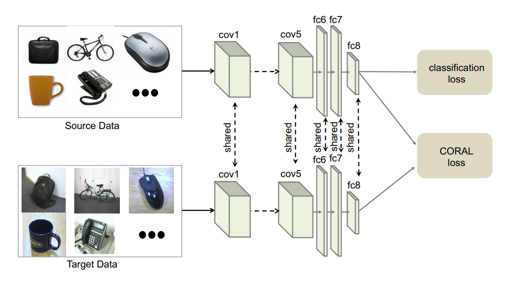

# Deep-Coral-Tf
A Tensorflow implementation of paper, **Deep CORAL: Correlation Alignment for Deep Domain Adaptation**.

Deep Coral is attributed as a solution to the problem faced by convolutional neural networks to generalize well across changes in input distributions. Domain adaptation algorithms have been proposed to compensate for the degradation in performance due to domain shift. 

One of the solutions to the problem of unsupervised domain adaptation is CORAL. CORAL is referred to by many as a *frustratingly easy* unsupervised domain adaptation method that aligns the second-order statistics of the source and target distributions with a linear transformation.

In the aforementioned paper, authors have attempted to extend CORAL to learn a non-linear transformation that aligns correlations of the activations of the last fully connected layer in deep convolutional neural networks, hence the phrase **Deep CORAL**.  

Sample Deep CORAL architecture based on a CNN with a classifier layer:

## Requirements
* Python 3.5
* Tensorflow

## Setup
1. Clone the source code and run `python3 train_net.py`. 

* It downloads the Office 31 dataset in the `'/office31_data` directory and also generates the TF-Records file. The Offcie 31 dataset contains images divided in three domains namely, **amazon**, **webcam** and **dslr**. Each domain consists of images across 31 different categories like bike, bottle, pen and so on. The categories contain variable number of images, however each image is of resolution *300x300*. Each image is resized to resolution *227x227* and the associated category is converted into an integer in the range (0, 30). The resized image is converted to a numpy array and together with the integer label is serialized into a TF example and subsequently written to the TF-Records file.

* In the current implementation, amazon is used as the source domain and webcam is used as the target domain. Thus, two TF-Records file namely *amazon.tfrecords* and *webcam.tfrecords* are generated. The sample images of the category bike in amazon and webcam domains respectively are shown below:

* Finally, training begins. Since a pre-trained Alexnet is used as the model, the weights of the Alexnet need to be downloaded and stored in the directory `/office31_data`. The link for downloading weights is [here](https://www.cs.toronto.edu/~guerzhoy/tf_alexnet/bvlc_alexnet.npy). The training is carried for 40 epochs and the training checkpoints are saved in `/office31_data/train`. Also, a summary of the loss, gradient and weights is also made and saved in `/office31_data/summary` and can be used for visualization in Tensorboard. 

2. To evaluate the model on the target distribution (**webcam** for the current implementation), run `python3 eval_net.py`. It performs the evaluation on the entire target dataset and prints the precision at the end. 

## Contributing
Suggestions and pull requests are actively welcome.

## References
1. Deep CORAL: Correlation Alignment for Deep Domain Adaptation. [(Paper)](https://arxiv.org/pdf/1607.01719)
2. A Pytorch implementation of Deep CORAL. [(Link)](https://github.com/SSARCandy/DeepCORAL)
